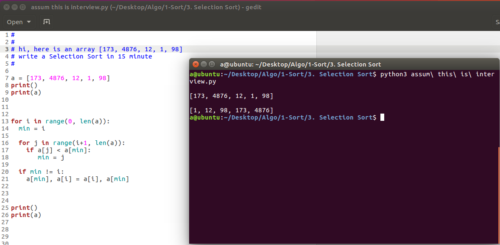

  
## 一句话总结选择排序
每次选出剩下元素里最小的  
放到前面  

### 细节
遍历整个数组, 找出最小的, 放到第 1 个位置  
从第2个位置开始遍历整个数组, 找出最小的, 放到第二个位置  
以此类推  

还是 2 个 for 循环嵌套  

 

Select-sort with Gypsy folk dance
https://www.youtube.com/watch?v=Ns4TPTC8whw  

visualgo
http://zh.visualgo.net/sorting.html  
