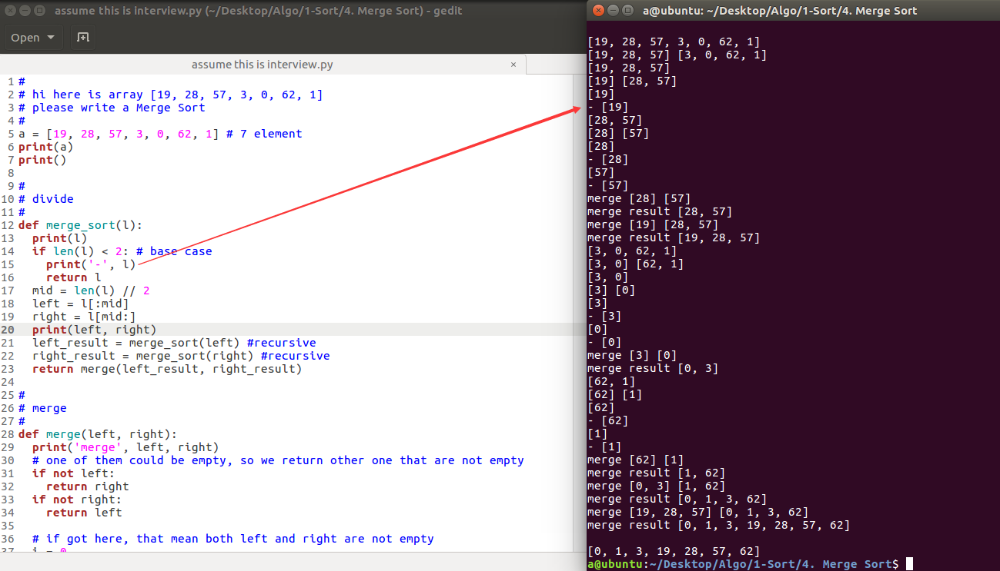

  
yep, pretty long code, you only need to read assume...interview.py file   
there are shorter version but little but harder to understand  
I put them in a.py and b.py  
##  一句话总结归并排序(Merge sort)
不断往下切, 切到剩下一个的时候就开始合并了  
比较两个数组的第一个元素  
把小的那一个放在排序结果数组里(假设你要的排序结果是从小到大)  
用到了递归 recursive. 这种算法是分而治之的 divide-and-conquer  

### 参考资料
https://www.youtube.com/watch?v=Nso25TkBsYI  
https://www.youtube.com/watch?v=EeQ8pwjQxTM  
http://interactivepython.org/courselib/static/pythonds/SortSearch/TheMergeSort.html  
https://pythonandr.com/2015/07/05/the-merge-sort-python-code/  

### 其他
print(8//2)  # 4  
print(8/2)   # 4.0  
  
2个斜杠和1个斜杠的除法有啥不同?  
// 返回整数　　／返回小数  
http://stackoverflow.com/questions/14444520/two-forward-slashes-in-python  
在 Python3 里即使2个数字都是整数, 一个斜杠除完之后返回的也是浮点数  
print(7//2) # 3  
print(5//3) # 1  

