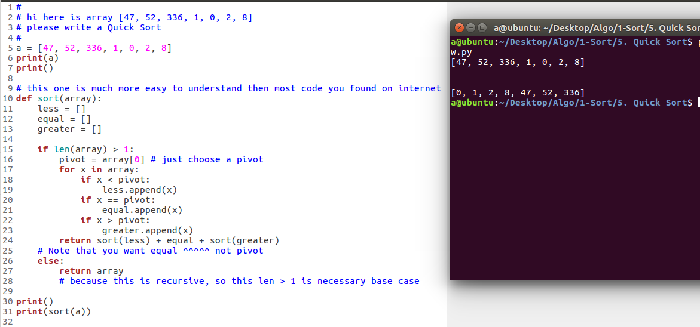

  
这种实现不是 in place 的  
## 一句话总结快速排序(Quick Sort)
Quick sort 和 Merge sort 都是分而治之的递归算法  
divide-and-conquer & recursive  
选个基准数字 pivot, 目标是最后使得右边的要比 pivot 大，左边的要比 pivor 小  
做到之后在处理 pivot 左半边的, 做一样的事情

### 基准数乱选是完全 OK 的，一般算法选第一个或者最后一个, 也有人用 random 选

