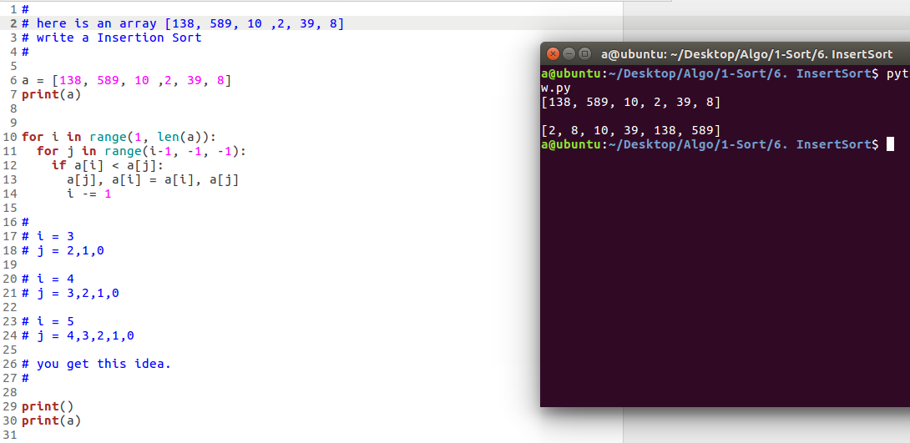

  
## 一句话解释插入排序(Insertion Sort)
从左到右，每次看一个新元素  
如果新元素比左边的小, 就和左边的交换, 交换之后再看看是否还比左边的小, 还小就还交换  
一直交换到比左边的大为止  

 
我自己以前经常搞不清选择排序和插入排序，  
__选择排序__是第1次遍历时，跑遍第一个元素到最后一个元素，找到最小的那个元素，
和第一个元素交换位置，这样的话我们就归为了第一个元素，它是全部元素里最小的，  
第2次遍历，从第二个元素跑到最后一个元素，找到最小的，和第二个元素交换，以此类推。  

__插入排序是__一开始只看到一个元素，不用排序，然后看第二个，  
问第二个元素是否小于它前面那个数字？是？和前面那个家伙换位  
其实和横向排队时，老师要求按照身高排序，你们向左右看，然后一个个的交换位置一样  

