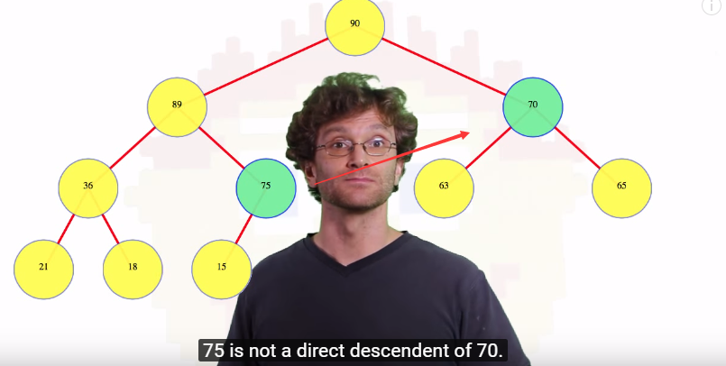
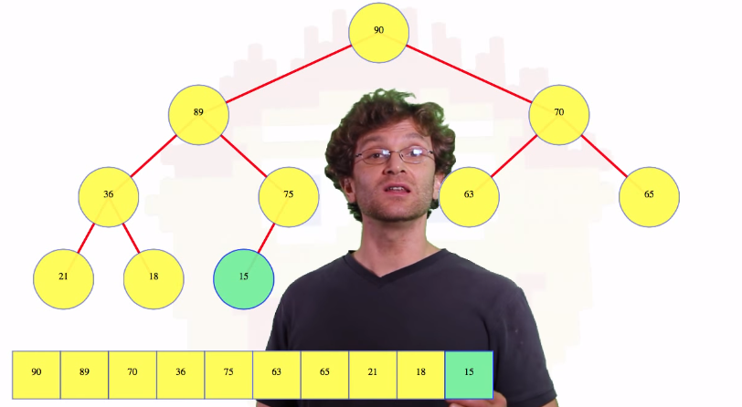

### Heap 是什么？
    Heap 有两种，一种是指内存分配的，一种是数据结构的.  
    这里讲的是数据结构的那种  
    

### Heap (数据结构)
    一种二叉树  
    所以树里的每个节点最多 2 个子节点，不能更多  

### 和二叉树(每个节点最多２个子节点)到底什么区别？  
  数字的排布方式，  
  如果全部节点都比直属下级大，就叫 max heap，
  注意两个子节点不用管顺序, 比如节点 8 左子节点是 2, 右子节点是 3 　　
  或者节点 8 左子节点是 3, 右子节点是 2. 两种情况都是合法的 max heap  
  如果全部节点都比直属下级小，就叫 min heap  
  min-heap 和 max-heap，没有第三种。  

  注意，如下这种情况是允许的，因为 75 不是 70 的直属子节点
    

### Heap 可以用来干嘛？
     Heap Sort 和 Priority Queue

### Heap 怎么表示的？
     数组:从上到下从左到右  
　　

### Heap 的操作：
     1 插入  
     2 删除，（返回最大元素）  

 
### 怎么把一个乱序数组变成 Max Heap？ 

  最大堆的插入： 
       从底部插入，向上比较和交换，　　 
       如果比上面大，就和上面交换，然后再和上面比较，直到碰到比上面小的，或者变成了 root，　　 

  最大堆的删除： 
       假设要删除 root, 就把root 和最后一个叶节点交换，然后删掉 root 
       这个叶节点可能会比直属两个节点小，所以要进行比较和交换，最后把这个叶节点正确归位。 
       先比较左右两个节点哪个大，因为大的要排上面，然后大的和叶节点交换。 
       叶节点现在在新位置了，再次和直属两个子节点比较。遵循一样的流程。 

  

 
### 必看资料，形象化展示了堆
https://www.cs.usfca.edu/~galles/visualization/HeapSort.html  
https://www.youtube.com/watch?v=WCm3TqScBM8  

 
#### 参考资料
1   
https://courses.cs.washington.edu/courses/cse373/06sp/handouts/lecture10.pdf  

2   
Presumably you mean heap from a memory allocation point of view, not from a data structure point of view (the term has multiple meanings).  
    http://stackoverflow.com/questions/2308751/what-is-a-memory-heap  

3  
https://github.com/raywenderlich/swift-algorithm-club/tree/master/Heap  

http://stackoverflow.com/questions/749199/when-would-i-want-to-use-a-heap   

4   
http://www.csanimated.com/animation.php?t=Heap_%28data_structure%29  

