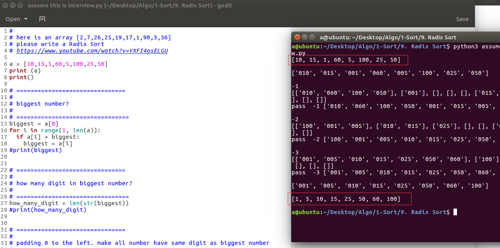

  

## 一句话总结基数排序(Radix Sort)
没心情总结,花几分钟知道就行了   
https://www.youtube.com/watch?v=YXFI4osELGU  
总之实际中很少用，大部分情况 quick sort 比 radix sort 好  
http://programmers.stackexchange.com/questions/77529/why-isnt-radix-sort-used-more-often  

